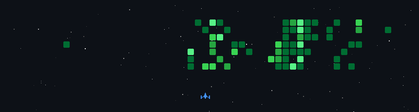

  <a href="https://netflix-theme-portfolio-five.vercel.app/">Portfolio</a> •
  <a href="https://www.instagram.com/shaik._.shivaji?igsh=ajU1c3VrMzFzcnJq">Instagram</a> •
  <a href="https://www.linkedin.com/in/shivaji-shaik-b92b19270/">LinkedIn</a> •
  <a href="https://drive.google.com/file/d/1tS8oS1rsBYyQkfrE8FiAmUrJ7Zg9rE3J/view?usp=sharing">Resume</a>

# 📊 GitHub Stats:
 
 

---

<!-- Proudly created with GPRM ( https://gprm.itsvg.in ) -->
